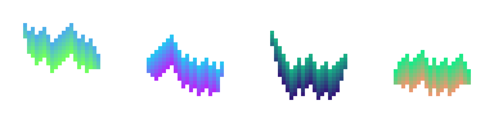
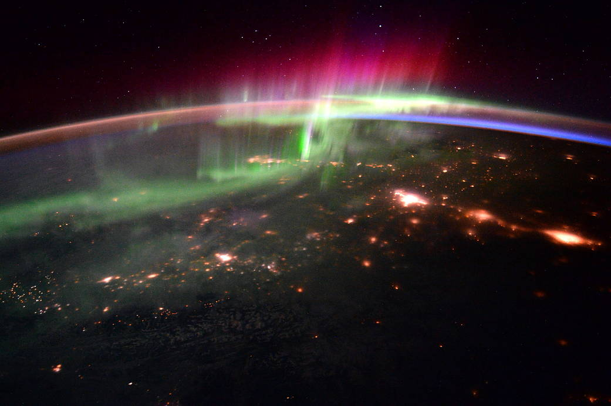
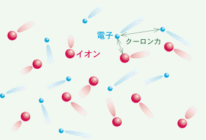
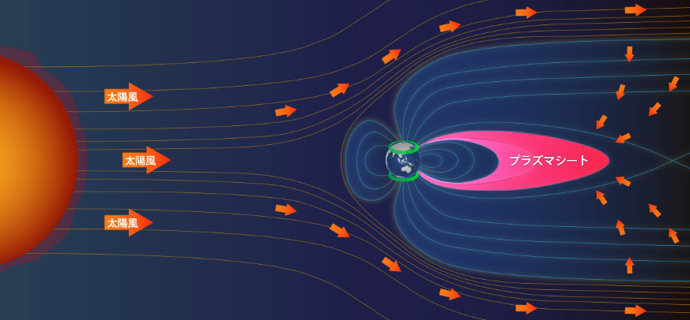
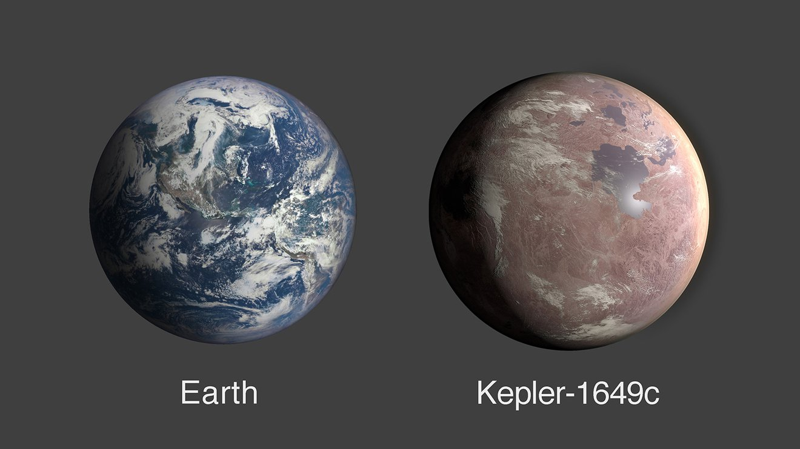

## 目次
1. [Project Overview, 概要](#project-overview)
2. [Story, オーロラの仕組み](#story)
3. [Planet and Northern Lights, 惑星とオーロラ](#planet-and-northern-lights)
4. [NFT and Northern Lights, NFTとオーロラ](#nft-and-northern-lights)
5. [The Future, まとめ](#the-future)
6. [FAQ, よくある質問](#faq)
7. [Reference, 参考文献](#reference)

# **Project Overview**

### Northern Lights Project

Fully on-chain, CC0 Public Domain, Generative Art, No Roadmap, No Discord, No Utility, No Rarity

- Sale day: 2022/10/21
- Supply: 150
- Mint Price: 0.01 ETH
- Per Wallet: 2 mint
- Only whitelist sale
- Minting site: Coming Soon

自身がクリエイターになることによって、より深くNFTを理解し、みんなで楽しみ、何か社会に役立てるインサイトを掴めるのではないかと思い、2022年10月9日に本格的にスタートさせました。当方は楽しいこと、面白いことを手を動かしてやっていこうという想いしか持ち合わせていません。同じ想いをお持ちの方はしばしお付き合いいただけますと幸いです。

[@yuk6ra](https://twitter.com/yuk6ra) の個人プロジェクトです。No Utilityであり、投機や投資対象にはなりえませんのでご理解のほどよろしくお願いいたします。DYOR / NFA

# **Story**

モチーフは「オーロラ（Aurora）」です。

オーロラの物語（仕組み）を見ていきましょう。

オーロラは、北半球の大陸で観測されることが多く、北の光＝ノーザン・ライツ（Northern Lights）と呼ばれています。この現象は太陽の活動が起点になっており、太陽から放射された太陽風が地球の大気と衝突することでオーロラが発生します。

出典: [NASA](https://www.nasa.gov/image-feature/aurora-and-the-pacific-northwest)

太陽風とは電子とイオンがバラバラな状態になった高温・高速の粒子（プラズマ）の風です。人体に悪影響を及ぼし、電子機器などの故障の原因にもなります。どれくらい怖い粒子なのか想像できない方もいるかもしれませんが、次のことを考えてみてください。コンピュータの故障原因にもなるため、ブロックチェーンのすべてのノードが同時に破壊されることも考えれるのです。（恐ろしいでしょう？）

出典: [プラズマとは？](https://p-grp.nucleng.kyoto-u.ac.jp/plasma/index.html)

幸いにもプラズマには磁気や電気の影響を受けやすい性質があるので、太陽風が地球まで到達すると地球の磁場によってプラズマが逸れていきます。この地球の磁場が届く領域を磁気圏と呼びます。地球は磁気圏という磁場のバリアによって太陽風から守られているのです。（ノードは守られました！）

しかし、すべてのプラズマを避け切ることはできず、磁場の密度が低い場所（バリアが弱い場所）から侵入を許してしまいます。特に太陽風によって変形した磁気は太陽の当たらない夜側が弱く、磁気圏の内部にプラズマをため込んでしまいます。この溜まった場所をプラズマシートと呼び、この大量のプラズマがオーロラのエネルギー源になります。

出典: [Aurora Navi](https://auroranavi.com/aurora/magnetosphere.html)

やがてこれらのプラズマは地球の磁気線に沿って、北極（N極）と南極（S極）の上空の隙間から降り注ぎます。その際に大気にある窒素や酸素の分子と衝突することによって、分子にエネルギーが与えられます。与えられたエネルギーは、元の状態に戻ろうとするため光となってエネルギーを放射します。私たちが目にするのはこの現象です。

地球の大気中の主な成分は窒素と酸素なので、衝突するときに放射する光の色は決まっています。さらに大気中の成分は高度によって異なるので、場所によって色も変化します。高い場所から赤、緑、ピンク・紫で観測されることが多いのはこのためです。

# **Planet and Northern Lights**

オーロラの色は大気中の成分によって変化します。地球では窒素78％、酸素21％、アルゴン0.93%と続きます。ここまで読んでくれた好奇心旺盛な方は疑問に思う方がいるかもしれません。

「他の惑星にオーロラはあるのだろうか」

「それはどんな色なんだろう」

まずオーロラは３つの条件が必要です。太陽風に晒されること（もしくはプラズマが発生していること）、磁場があること、大気があることです。

太陽系では、十分な磁場と大気を持つ木星と土星で見ることができます。両惑星の大気中の成分はほとんどが水素なので、肉眼ではピンクに見えるはずです（下記の土星の写真ではピンクに見えないのはなぜだかわかりますか？）。磁場を持っているが大気を持たない水星、大気はあるが磁場がない金星、磁場が弱く大気が薄い火星などは期待できません。

{:width="50%"}

出典: [NASA](https://www.nasa.gov/multimedia/imagegallery/image_feature_1083.html)

太陽系外の惑星系はどうでしょう。太陽風と同じように惑星系の恒星からは恒星風が吹いています。磁場があり、大気がある惑星であらばオーロラの観測は期待できるでしょう。

もし私たちが地球以外の惑星に住むことになれば、どんなオーロラを見ることができるでしょうか。これが今回のNFTに盛り込んだプロパティになります。

生命居住可能領域=ハビタブルゾーン（Habitable Zone）に位置する代表的な惑星を６つ選びました。
- Teegarden's Star b
- TOI-700 d
- Kepler-1649 c
- TRAPPIST-1 d
- K2-72e
- Proxima Centauri b

出典: [NASA, Earth-Size Habitable-Zone Planet Found Hidden in Early NASA Kepler Data, 2020](https://www.jpl.nasa.gov/news/earth-size-habitable-zone-planet-found-hidden-in-early-nasa-kepler-data)

実はハビタブルゾーンに位置する惑星のほとんどは大気中の成分まで明らかになっていません。2019年のNASAの発表によると、K2-18bがハビタブルゾーン系惑星ではじめて水蒸気を観測し、その大気中の成分が水素とヘリウムであることが明らかになったところです。したがって、オーロラの発生に期待できても色まではわからないのが結論です。

一体何色なんだろうか。今回のプロジェクトでは、そのロマンをブロックチェーンに刻みます。（もちろん地球色のオーロラも用意しています！）

第二の地球に移り住みはじめ、人類が惑星間種族になる時代、SFのワープ・ドライブが生まれる時代までブロックチェーンは生き残っているのでしょうか。そんなことを考え出すと宇宙のように想像というのは無限大に広がっていきます。

出典: Pixabay

# **NFT and Northern Lights**

話を宇宙からオーロラに戻しましょう。

私はプロジェクトのアイデアを考えながらオーロラの現象を調べていくうちに、NFT通じるものがあると思いました。太陽風は人体や電子機器に悪影響を及ぼす怖い現象ですが、私たちにオーロラという素晴らしい恩恵を与えてくれ、プラズマは半導体などの工業製品を開発するのに必要不可欠な存在です。

私たちは常に自然から学びを得ることができます。現象の本質は何も変わりません。

使い方によって恩恵があることもあれば、悪影響もあります。スマホ、AI（人工知能）、核、ブロックチェーン等々すべてのテクノロジーは人類がどう扱うかにかかっています。NFTというテクノロジーの本質は変わりませんが、色を付けるのは私たちです。

Web3だからと言って極端に何でもすべてオープンに受け入れなければならないということはないでしょう。東洋哲学の「中庸」に学べます。そして、きっと良い使い方や悪い使い方があるんだと思います。詐欺には「悪い」を突き付けていく勇が必要です。

しかし、本当に難しいのは完璧に善悪に決着はつけられないということです。

私はこう考えています。「きっとこうなんじゃないか？」と自分が思ったら、同じ未来を思い描いている人と共に、一歩でも世の中やみんなが幸せになる方向へ前進していくしかないと。それは自分の考え、信念や直感で動いていくしかないんだと思います。正解かどうかの答え合わせはありません。

NFTに関しては「コミュニティが大事だ」「ユーティリティだ」「いや、絵の質こそが大事だ」と様々な意見がありますが、あまりにもサンプルが少なすぎると思っています。宇宙の話を思い出しましょう。本格的に宇宙進出するまでにブロックチェーンは生き残っているのでしょうか。ブロックチェーンよりももっともっと発展したテクノロジーが出てくるような気がしてなりません。十中八九そうでしょう。

ある歴史の一瞬に過ぎない今日。私たちに今最も必要なことは視野を広げることです。あらゆる可能性を模索し、実験を繰り返し、半歩でも理想に向けて共に前進することだと思っています。

そして何よりも楽しむこと。楽しむ者に勝るものはありません。

# **The Future**

高いエネルギーを持たない限り、良い景色は見ることはできません。まるでNFTに夢中になっている人たちのようですね。オーロラのロマンをブロックチェーンに刻んでみましょう。

今後もいくつかプロジェクトを考えています。

高いエネルギーを持った人たちと共にWeb3やNFTの領域を微力ながら前進させられたら幸いです。このプロジェクトをきっかけに何かしら良い影響があることを願っています。

[ご意見・ご感想フォーム](https://docs.google.com/forms/d/e/1FAIpQLSdZUeUxEOCBSAZvnCNdHc4z4kAllffVylgUnobidXJ4EezCkg/viewform?usp=sf_link)

# **FAQ**

- どうすればWLを貰えますか？　A. 友達になりましょう。
- なぜSupplyが150なんですか？　A.手の届く範囲で進めたいからです。
- なぜウォレットごとに2ミントなんですか？　A.1つ目のミントで気に入らない色が出たらテンション下がりそうだから。
- 何に使えますか？　A.実用性は考えていません。CC0なのでお好きにお使いください。
- なぜオーロラなんですか？　A.そもそも宇宙が好きで関連したものを最初のプロジェクトのモチーフにしたかったから。
- 連絡を取りたいです。どうすればいいですか？　A.TwitterのDMしか勝たん。もしくはContactページにあるメールへ。
- オーロラを見たことはありますか？　A.ありません。見たいので連れてってください。
- どうしてもNFTが欲しいです。　A.要望があればですが別コンで黒背景versionでもやりますかね。感想ください。

# **Reference**

- Aurora Navi, [https://auroranavi.com/aurora/](https://auroranavi.com/aurora/)
- NASA, What Is the Habitable Zone?, [https://www.youtube.com/watch?v=J04YN9azln8](https://www.youtube.com/watch?v=J04YN9azln8)
- JAXA, 躍動する磁気圏 磁場から宇宙の謎にせまる, [https://www.youtube.com/watch?v=tY-OUFU-z78](https://www.youtube.com/watch?v=tY-OUFU-z78)
- NASA, NASA’s Hubble Finds Water Vapor on Habitable-Zone Exoplanet for 1st Time, 2019, [https://www.nasa.gov/feature/goddard/2019/nasa-s-hubble-finds-water-vapor-on-habitable-zone-exoplanet-for-1st-time](https://www.nasa.gov/feature/goddard/2019/nasa-s-hubble-finds-water-vapor-on-habitable-zone-exoplanet-for-1st-time)