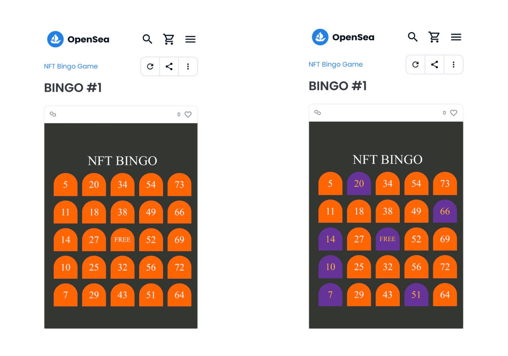
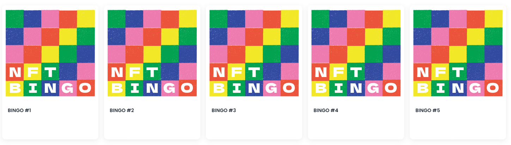
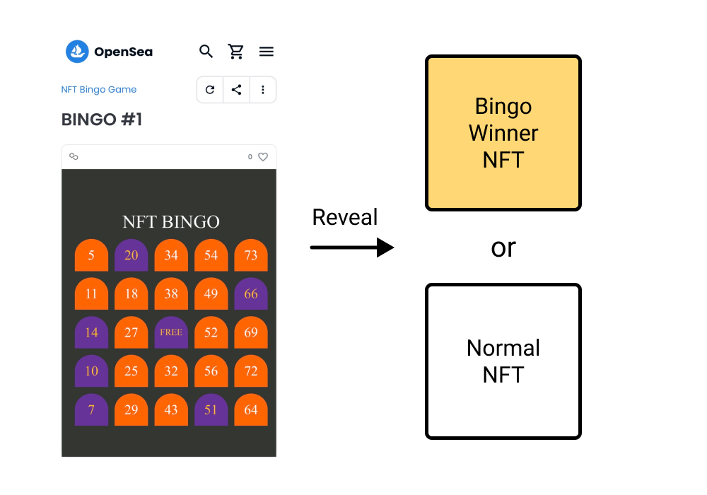

作成日：2022-10-28
更新日：2022-10-29

# 目次
1. [はじめに](#はじめに)
2. [今日の記念NFT](#今日の記念nft)
3. [もしNFTでビンゴ大会をしたら](#もしnftでビンゴ大会をしたら)
4. [現在に機能を持たせる](#現在に機能を持たせる)
5. [最後に](#最後に)

# はじめに welcome

皆さんもNFTをやっていると記念NFTを貰うことがよくあると思います。私も貰ったり、配布したりしてきました。最近はただ貰うことに退屈してきましたので別のことを考えてみたというのが今回のお話です。

IRLイベントで配布される記念NFTをちょっとしたアイデアで面白くしてみたいと思います。題材はビンゴです。ビンゴカードをNFTにして、NFT色の強いビンゴ大会をNFTのイベントでやったら面白そうです。

それほど難しくありません。大したアイデアではなく、ちょっとしたアイデアです。

# 今日の記念NFT

NFTのIRLイベントで記念NFTを配布しているのをよく見かけます。ここでは記念NFTは「参加したら記念で無料で貰えるNFT」と位置付けます。

今日の記念NFTは、思い出の記憶として貰うことが一般的であり、多くは将来もしかしたら活用されるかもしれないという曖昧な役割しか持っていません。かくいう私も、[POAP](https://poap.xyz/)などのサービスを使い、IRLのイベントや勉強会の出席者に対してNFTを配布することがあります。配布する理由は将来使えるかもしれないと思うからです。しかし、これではNFTを貰う動機が弱く、NFTが好きな人しか貰わない可能性が高いでしょう。

もうちょっと工夫して、面白くできないでしょうか？

たとえば、チケットには入場などの確認として使う機能があります。お客さんが入場の対象者なのかをチケットを持っているかどうかで分類したり、席の順番を確認したり、現在使えるような機能が存在するでしょう。だからこそ、チケットは必須になります。機能が終了してからは、ついでに思い出として保管されることもあります。ここが現状の記念NFTにそっくりな部分です。

1時間にも満たない時間で友人とあれこれ考えていました。

# もしNFTでビンゴ大会をしたら

こんなのはどうでしょうか。

NFTのIRLイベントでビンゴ大会をやります。ビンゴカードは100均に売っているカードを使うのもよいかもしれません。しかし、ビンゴカードは同じものが1つもなく（一袋の中だけの世界で）、Non-FungibleなのでそのままNFTの性質を持っています。ここは敢えて、インタラクティブ性を持ったNFTのビンゴカードを使っていきます。（実際のNFTはこちら→[Opensea](https://opensea.io/collection/nft-bingo-game)）

入場のとき、来場者には「ビンゴ大会をするのでビンゴカードをNFTとしてお渡しします」と伝えます。ここでウォレットアドレスを収集し、ビンゴ大会が始まる前までに各ウォレットアドレスへNFTのビンゴカードを送付します。あとは普段通りにビンゴ大会を行うだけです。

これで準備は整いました。ビンゴ大会の途中では、ビンゴした人にToken IDを聞いておきます。まずは通常のビンゴ大会と同様に物理的な景品はその場で渡しましょう。

次にビンゴ大会が終了したときのことを想定してみます。

終了後はNFTのビンゴカードをリビールさせることによって今回のIRLイベントの記念NFTにするのです。手元にはToken IDがあると思うので、ビンゴした人には特別なNFTをリビールさせて、ビンゴしなかった人には通常の記念NFTをリビールさせます。

以上が「もしNFTでビンゴ大会をしたら」です。

# 現在に機能を持たせる

シンプルな図を書いてみました。人々はなぜ記念のNFTを貰うのか。

「過去」に来場したIRLイベントを思い出として残したい。「将来」に何か良いことがあるかもしれない（期待）からとりあえずもらいたい。私はそんな理由が思いつきました。もちろん、他にもあると思います。しかし「現在」の役割はなさそうです。

IRLイベントで初心者の方にNFTを配布していると「これ（NFT）貰ったらどうするんですか？」と聞かれることが多々あります。そして毎回答えに困ります。「思い出になります」「参加した証明になります」「今後何かに使うと思います」そんなことを伝えてきました。

では上記で想定したビンゴ大会の場合はどうだったでしょうか？「現在」に役割がありました。それは「ビンゴ大会に参加する」という機能です。

リビールさせることでビンゴカードとしての機能は失いますが、チケットのように思い出や将来的な何かには結果的に活用できます。その役割は変わっていませんね。

これは汎用的に使えるちょっとしたアイデアだと思います。他にも使えそうです。必要な要素はリアルタイム性であり、その場のイベントで使う機能があることだと思います。

記念NFTはリビールがあれば記録や期待といった役割を果たすことができます。

# 最後に

「なんだ！そんなことか！」と思われたかもしれませんが、少なくともこの１年間で私が参加してきたIRLイベントではこういった記念NFTは貰ったことがありませんでした。

IRLイベントでNFTのビンゴ大会をやってみたい方はそのまま使えますし、大会名、トークン名、カバー画像、記念NFTの画像等々必要な変更は対応できていると思います。ビンゴ大会の他にも面白そうなアイデアがありましたら、ひとまずやってみましょう。言っていただければサポートもできます。

最近は日本でも「NFTは紙である」というスレッドが大きな反響を呼びました。改めて、NFTには色々な使い道がありそうだということがわかります。

# Reference

- NFT BINGO Game, [https://opensea.io/collection/nft-bingo-game](https://opensea.io/collection/nft-bingo-game)
- NFTとは？を説明するのに「紙である」というのは一つの答えであるというスレッド, [https://twitter.com/NftPinuts/status/1584579038596583430?s=20&t=HuWMNXEAhl5XaiXVGLmDlg](https://twitter.com/NftPinuts/status/1584579038596583430?s=20&t=HuWMNXEAhl5XaiXVGLmDlg)
