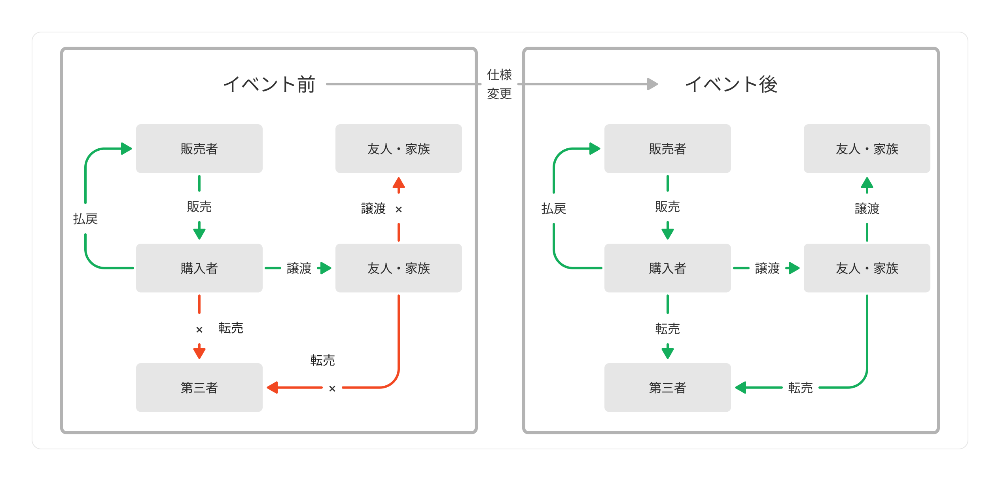
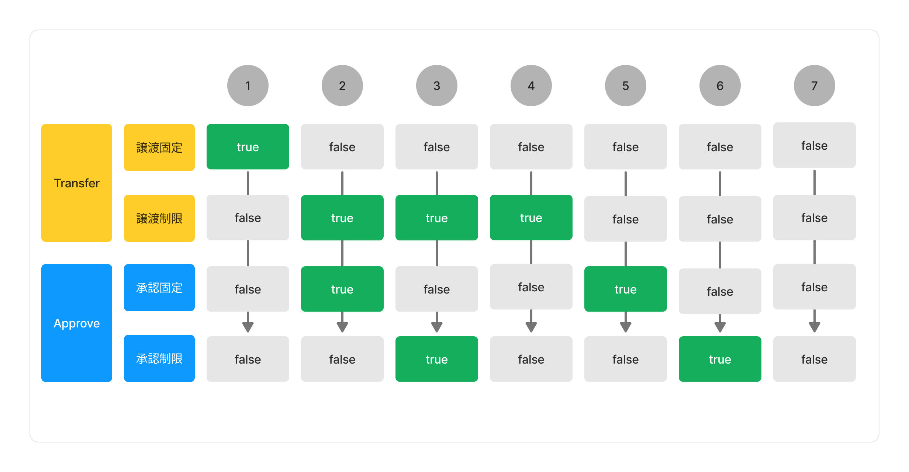
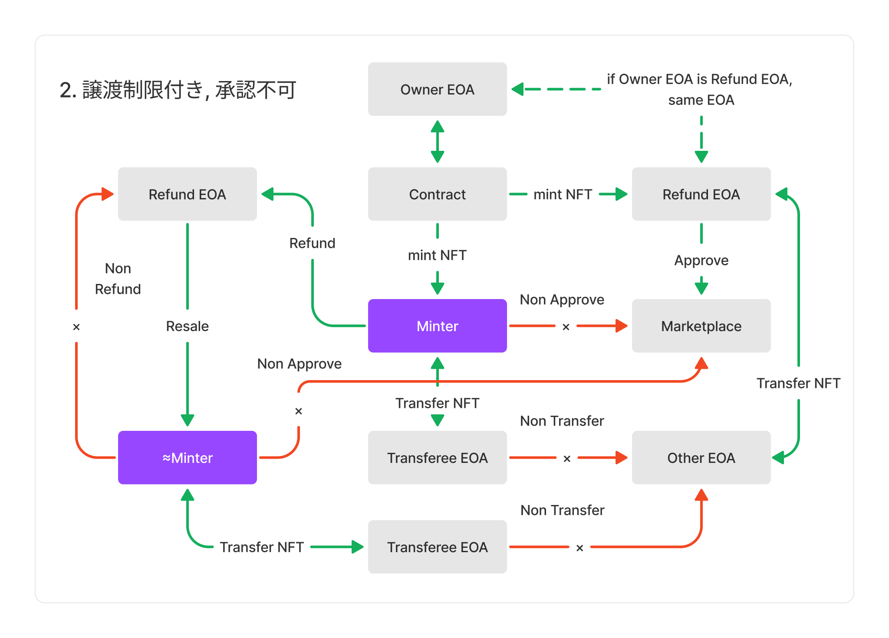

# Abstract

現在、利用されている標準的なNFT（ERC721）に現実に即したチケットの機能を付与し、現状のチケットの課題のソリューションを考えます。これはERC721と併用する拡張的なインターフェースの提案です。

# Motivation

NFTはイベント参加のチケットとしての機能を持ち、近年ではオリンピックのチケットとしても利用が期待されています。しかし、現実のチケットの課題と同様に、高額な転売を目的としたチケットNFTが課題になってくると思います。これはNFTおよびチケットの投機性をますます助長します。抽選で外れてしまった人の多くは余分なお金を支払わなければなりません。チケットの販売者は、サービスを提供したい対象者にチケットを購入してほしいのであって、チケットで儲けるために購入してほしいのではありません。そこでチケットの基本的な機能を考えることにします。

チケットの基本的な機能

1. 対象者のみサービスを受けることができる
2. 知人や友人に譲渡ができる
3. 記念に保存できる

SBT（Soulbound Token）のチケットを解決策として考えることは妥当だと思われがちですが、SBTの概念は不完全であり、現実的ではありません。何より臨機応変に誰かに渡したりといった譲渡ができないことに私たちは不安を覚えるでしょう。このようにNFTを利用するチケットにはいくつかの課題があります。代表的な課題は次の通りです。

1. NFT: 転売可能なので誰でも参加でき、複垢も容易である
2. SBT: 一切融通ができず記念品としての市場価値も一切ない

NFTタイプは誰でも参加できるがゆえに多くの課題を残します。SBTタイプは良い線を行っていますが、チケットを使い終わっても譲渡ができず販売ができないのが難点です。なぜなら、現実ではファンはコレクターでもあります。自分が参加できなかったイベントのチケットは高額を出してでも欲しい人はいるでしょう。これはイベント前にチケットを高額で購入する動機とは全く違う動機なのです。



上記の図は、イベント前とイベント後で仕様を切り分けて考えたときの理想的な構図です。ここでは転売目的の購入者は譲渡の制限と販売の制限があることで購入する動機が限りなく少なくなると仮定します。

まず譲渡には制限をかけることが必要だと思います。この機能の目的はイベント前に身近な人物（たとえば家族や友人たち）と譲渡の融通が利くように設計するためです。無制限に譲渡を許可する必要はなく、購入者の周りで譲渡を許可してあげれば良いでしょう。とにかくSBTに近い設計にし、譲渡はできるけどなるべく少なく制限するのです。そしてNFTの転売機能も制限することができれば理想的な構図に近づくのではないでしょうか。ここではNFTマーケットプレイスの承認（Approve）ができるということは転売が可能と同じことだとします。



上記の図は、考えられるすべての可能性です。

1. 譲渡不可能 → SBT
2. 譲渡制限付き/販売不可能 → 友人や家族に一度だけ譲渡のみ可能である
3. 譲渡制限付き/販売制限付き → 友人や家族に一度だけ譲渡のみ可能で、指定のマーケットプレイスで一度だけ販売もできる
4. 譲渡制限付き/販売無制限→ 友人や家族に一度だけ譲渡のみ可能で、マーケットプレイスでも一度だけ販売することができる
5. 譲渡無制限/販売不可能→譲渡は何回でも可能である
6. 譲渡無制限/販売制限付き→譲渡は何回でも可能だが、指定のマーケットプレイスでしか販売はできない
7. 譲渡無制限/販売無制限→NFT

補足
- 譲渡制限付き: 購入者は譲渡可能で、譲受人は第三者に譲渡することができない
- 販売制限付き: 指定のマーケットプレイスにのみアクセスが可能である（独自マケプレを想定）

たとえば2の場合をは下記の図のようになります。




再販不可の目的は「販売を禁止し、サービスを受けたい人だけが買えるようにする」ことです。しかし、再販不可はイベント終了前までです。なぜならイベント終了後にチケットはコレクターのためのものになるからです。

このように譲渡制限と販売不可の機能を付与することによって、イベントに行きたい人しかチケットを買うことができないようにし、イベント後はコレクターやファン、イベントに行きたくても行けなかった人にも届くようにします。


# Specification

（下書き中）

```solidity
// SPDX-License-Identifier: MIT

pragma solidity ^0.8.17;

interface IEIP5995 {
    /// @dev Transfer Condition
    /// @param from address representing the previous owner of the given token ID
    /// @param to target address that will receive the tokens
    /// @param tokenId uint256 ID of the token to be transferred
    /// @return bool whether this is valid transfer
    function isValidTranfer(address from, address to, uint256 tokenId) external view returns(bool);

    /// @dev Approval Condition
    /// @param operator traget address that want to approve
    /// @return bool whether this is valid approval
    function isValidApproval(address operator) external view returns (bool);
}
```

# Example Implementation

（下書き中）


```solidity
// SPDX-License-Identifier: MIT

pragma solidity ^0.8.17;

import "@openzeppelin/contracts/token/ERC721/ERC721.sol";

contract ERC5995 is ERC721 {

    // Refund Address 
    address public _refundAddress;

    // Locked
    bool private _isLockedTransfer;
    bool private _isLockedApproval;

    // Restricted
    bool private _isRestrictedTransfer;
    bool private _isRestrictedApproval;

    // Mapping token id to minter address
    mapping(uint256 => address) private _minters;

    // Mapping operator address to bool
    mapping(address => bool) private _approvalOperators;

    event TransferControl(bool lock, bool restriction);
    event ApprovalControl(bool lock, bool restriction);
    event AddApprovalOperator(uint256 indexed operator, bool status);

    constructor(
        string memory name_,
        string memory symbol_
    ) ERC721(name_, symbol_) {
        _refundAddress = msg.sender;
    }

    ////////////////////////////////////////////
    ///     Transfer Control
    ////////////////////////////////////////////

    function _transferControl(bool lock, bool restriction) internal virtual {
        _isLockedTransfer = lock;
        _isRestrictedTransfer = restriction;
    }

    function isLockedTransfer() public view returns (bool) {
        return _isLockedTransfer;
    }

    function isRestrictedTransfer() public view returns (bool) {
        return _isRestrictedTransfer;
    }

    ////////////////////////////////////////////
    ///     Minter
    ////////////////////////////////////////////

    function _minter(address to, uint256 tokenId) internal virtual{
        _minters[tokenId] = to;
    }

    function minterOf(uint256 tokenId) public view returns (address) {
        require(_exists(tokenId), "Not exists");
        return _minters[tokenId];
    }
    
    function isMinter(address minter, uint256 tokenId) public view returns (bool) {
        return _minters[tokenId] == minter;
    }

    ////////////////////////////////////////////
    ///     Approve Control
    ////////////////////////////////////////////

    function _approvalControl(bool lock, bool restriction) internal virtual {
        _isLockedApproval = lock;
        _isRestrictedApproval = restriction;
    }

    function isLockedApproval() public view returns (bool) {
        return _isLockedApproval;
    }

    function isRestrictedApproval() public view returns (bool) {
        return _isRestrictedApproval;
    }

    function setApprovalOperator(address operator, bool status) internal virtual {
        _approvalOperators[operator] = status;
    }

    function isApprovalOperator(address operator) public view returns (bool) {
        return _approvalOperators[operator];
    }

    ////////////////////////////////////////////
    ///     Check Control
    ////////////////////////////////////////////

    function isValidTranfer(address from, address to, uint256 tokenId) public view returns(bool) {
        return
            (!isLockedTransfer() && (isRestrictedTransfer() && isMinter(from, tokenId)))    ||
            (!isLockedTransfer() && (isRestrictedTransfer() && isMinter(to, tokenId))) ||
            (!isLockedTransfer() && !isRestrictedTransfer()) ||
            (_refundAddress == msg.sender || _refundAddress == to);
    }

    function isValidApproval(address operator) public view virtual returns (bool) {
        return
            (!isLockedApproval() && (isRestrictedApproval() && isApprovalOperator(operator)))  ||
            (!isLockedApproval() && !isRestrictedApproval()) ||
            (_refundAddress == msg.sender);
    }

    ////////////////////////////////////////////
    ///         Refund
    ////////////////////////////////////////////

    function renewRefundAddress(address refundAddress) internal {
        _refundAddress = refundAddress;
    }

    function _refund(uint256 tokenId, uint256 refundPrice, uint256 refundEndTime) internal virtual {
        require(msg.sender == ownerOf(tokenId), "Not owner of this token");
        require(isRefundActive(refundEndTime), "Expired");
        require(isMinter(msg.sender, tokenId), "Not minter");

        transferFrom(msg.sender, _refundAddress, tokenId);
        payable(msg.sender).transfer(refundPrice);

        delete _minters[tokenId];
    }

    function isRefundActive(uint256 refundEndTime) public view virtual returns (bool) {
        return block.timestamp <= refundEndTime;
    }

    ////////////////////////////////////////////
    ///     Override
    ////////////////////////////////////////////

    /**
     * @dev Safely mints `tokenId` and transfers it to `to`.
     *
     * Requirements:
     *
     * - `tokenId` must not exist.
     * - If `to` refers to a smart contract, it must implement {IERC721Receiver-onERC721Received}, which is called upon a safe transfer.
     *
     * Emits a {Transfer} event.
     */
    function _safeMint(address to, uint256 tokenId) internal virtual override {
        _safeMint(to, tokenId, "");
        _minter(to, tokenId);
    }

    function _transfer(address from, address to, uint256 tokenId) internal virtual override {
        require(isValidTranfer(from, to, tokenId), "No transfer");
        if (_refundAddress == msg.sender) {
            _minter(to, tokenId);
        }
        super._transfer(from, to, tokenId);
    }

    function setApprovalForAll(address operator, bool approved) public virtual override {     
        require(isValidApproval(operator), "No approval");
        super.setApprovalForAll(operator, approved);
    }

    function approve(address to, uint256 tokenId) public virtual override {
        require(isValidApproval(to), "No approval");
        super.approve(to, tokenId);
    }
}
```


# Test Cases

ライブチケットの発行の例。

（下書き中）

```solidity
// SPDX-License-Identifier: MIT

pragma solidity ^0.8.17;

import "hardhat/console.sol";
import "./ERC5995.sol";

contract LiveTicket is ERC5995, Ownable {
    uint256 public totalSupply;

    // Refund
    uint256 public endtime;
    uint256 public refundPrice = 0.001 ether;
    
    constructor() ERC5995("LiveTicket", "TICKET") {
        _transferControl({lock: false, restriction: true});
        _approvalControl({lock: true, restriction: false});
    }

    function mint() public payable {
        require(msg.value >= 0.01 ether, "Not enough");
        _safeMint(msg.sender, totalSupply);
        totalSupply++;
    }

    function setTransferControl(bool _lock, bool _restriction) external onlyOwner {
        _transferControl(_lock, _restriction);
    }

    function setApprovalControl(bool _lock, bool _restriction) external onlyOwner {
        _approvalControl(_lock, _restriction);
    }
    
    function refund(uint256 tokenId) external { 
        _refund(tokenId, refundPrice, endtime);
    }

    function setEndtime(uint256 period) public onlyOwner {
        endtime = block.timestamp + period;
    }

    function setRefundPrice(uint256 _price) public onlyOwner {
        refundPrice = _price;
    }
}
```


# Copyright

Copyright and related rights waived via CC0.