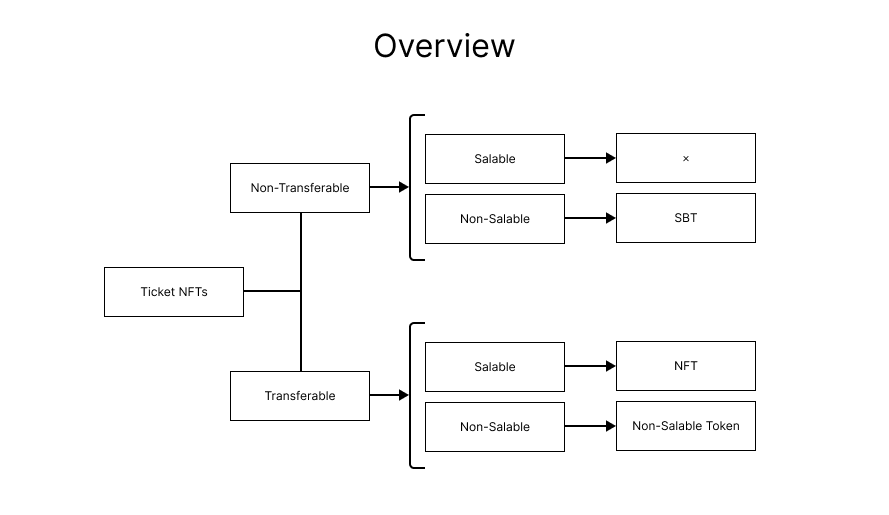
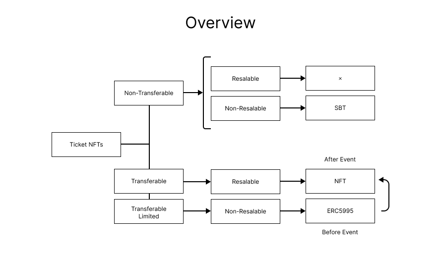

# Abstract

現在、利用されている標準的なNFT（ERC721）に現実に即したチケットの機能を付与し、現状のチケットの課題のソリューションを考えます。これはERC721と併用する拡張的なインターフェースの提案です。

# Motivation

NFTはイベント参加のチケットとしての機能を持ち、近年ではオリンピックのチケットとしても利用が期待されています。しかし、現実のチケットの課題と同様に、高額な転売を目的としたチケットNFTの入手が課題になっています。これはNFTおよびチケットの投機性を助長し、チケットの目的には反することになります。抽選で外れてしまった人の多くは余分なお金を支払わなければなりません。チケットの販売者は、サービスを提供したい対象者にチケットを購入してほしいのであって、チケットで儲けるために購入してほしいのではありません。そこでチケットの基本的な機能を考えることにします。

チケットの基本的な機能

1. 対象者のみサービスを受けることができる
2. 融通ができる
3. 記念に保存できる

SBT（Soulbound Token）のチケットを解決策として考えることは妥当だと思われがちですが、SBTの概念は不完全であり、現実的ではありません。何より臨機応変に融通ができないことに私たちは不安を覚えるでしょう。このようにNFTを利用するチケットにはいくつかの課題があります。代表的な課題は次の通りです。

1. NFT: 転売可能なので誰でも参加でき、複垢も容易である
2. SBT: 融通ができず記念品としての市場価値も一切ない



NFTタイプは誰でも参加できるがゆえに多くの課題を残します。ご想像の通りです。SBTタイプは良い線を行っていますが、チケットを使い終わっても譲渡ができず販売ができないのが難点です。なぜなら、現実ではファンはコレクターでもあります。自分が参加できなかったイベントのチケットは高額を出してでも欲しい人はいるでしょう。これはイベント前にチケットを高額で購入する動機とは全く違う動機なのです。

これを解決するための鍵は第三のタイプにあります。仮に「Non-Salable Token = NST」とします。NSTはトランスファーだけ可能で販売は不可能なNFTです。

少し改良してあげましょう。次の図を見てください。



まずトランスファーには制限をかけます。この機能の目的はイベント前に身近な人物（たとえば家族や友人たち）と融通が利くように設計するためです。何度もトランスファーを許可する必要はなく、1・２回許可してあげれば良いでしょう。とにかくSBTに近い設計にし、トランスファーはできるけどなるべく少なく制限するのです。

そして再販不可も付与します。再販不可の目的は「販売を禁止し、サービスを受けたい人だけが買えるようにする」ことです。しかし、再販不可はイベント終了前までです。なぜならイベント終了後にチケットはコレクターのためのものになるからです。

このようにトランスファーの制限と再販不可の機能を付与することによって、イベントに行きたい人しかチケットを買うことができないようにし、イベント後はコレクターやファン、イベントに行きたくても行けなかった人にも届くようにします。

# Specification

（下書き）

```solidity
// SPDX-License-Identifier: MIT

pragma solidity ^0.8.17;

interface IEIPTicket {
    /// @dev Emitted when set transfer limits of the token
    event TransferLimit(uint256 indexed tokenId, uint256 indexed transferLimit);

    /// @dev Emitted when set salable or not
    event Salable(bool indexed status);

    /// @dev Tikets ERC721
    /// @param tokenId the NFT you want limit transfer
    /// @param transferLimit number of transfer limits
    function setTransferLimit(uint256 tokenId, uint256 transferLimit) external;

    /// @dev can check all tokenId
    /// @param tokenId token number
    /// @return remaining count of transfer
    function transferLimitOf(uint256 tokenId) external view returns (uint256);

    /// @notice status of the salable setting.
    /// @return tokens is salable or not
    function isSalable() external view returns (bool);
}
```

# Example Implementation

（下書き）


```solidity
// SPDX-License-Identifier: MIT

pragma solidity ^0.8.17;

import "@openzeppelin/contracts/token/ERC721/ERC721.sol";
import "./IEIPTicket.sol";

contract ERCTicket is ERC721 {
    uint256 public totalSupply;
    bool private _isSalable;
    mapping(uint256 => uint256) private _transferLimits;
    mapping(uint256 => uint256) private _availableLimits;
    mapping(address => bool) private _allowedContractList;

    event TransferLimit(uint256 indexed tokenId, uint256 indexed transferLimit);
    event Salable(bool indexed status);

    constructor() ERC721("ABC", "ABC") {}

    function mint() public {
        _safeMint(msg.sender, totalSupply);
        totalSupply++;
    }
    
    function setTransferLimit(uint256 tokenId, uint256 transferLimit) public {
        emit TransferLimit(tokenId, transferLimit);
        _transferLimits[tokenId] = transferLimit;
    }

    function transferLimitOf(uint256 tokenId) public view returns (uint256) {
        return _transferLimits[tokenId];
    }

    function isTransferable(uint256 tokenId) public view returns (bool) {
        return _transferLimits[tokenId] != 0;
    }

    function setAvailableLimit(uint256 tokenId, uint256 availableLimit) public {
        _availableLimits[tokenId] = availableLimit;
    }

    function isAvailable(uint256 tokenId) public view returns (bool) {
        return _availableLimits[tokenId] != 0;
    }

    function salable(bool status) public {
        _isSalable = status;
        emit Salable(status);
    }

    function isSalable() public view returns (bool) {
        return _isSalable;
    }

    function useOf(uint256 tokenId) public virtual returns (uint256){
        require(isAvailable(tokenId), "Already used");
        _availableLimits[tokenId]--;
        return _availableLimits[tokenId];
    }

    function checkTransfer(uint256 tokenId) internal virtual returns (bool) {
        require(
            !_exists(tokenId) ||
            isTransferable(tokenId),
             "Token is aleady exist, or is NOT t"
        );

        if (_exists(tokenId) && !isSalable()){
            _transferLimits[tokenId]--;
        }

        return true;
    }
    
    function _beforeTokenTransfer(
        address from,
        address to,
        uint256 tokenId,
        uint256 batchSize
    ) internal override virtual {
        require(checkTransfer(tokenId), "check is working");
        super._beforeTokenTransfer(from, to, tokenId, batchSize);
    }

    function addAllowedContract(address _contract) public virtual {
        _allowedContractList[_contract] = true;
    }

    function isAllowedContract(address _contract) public view returns (bool) {
        return _allowedContractList[_contract];
    }

    function setApprovalForAll(address operator, bool approved) public virtual override {
        require(isAllowedContract(operator) || isSalable(), "approve func: is not salable");
        super.setApprovalForAll(operator, approved);
    }

    function approve(address to, uint256 tokenId) public virtual override {
        require(isSalable(), "approve func: is not salable");
        super.approve(to, tokenId);
    }

}
```


# Copyright

Copyright and related rights waived via CC0.